<picture>
  <source media="(prefers-color-scheme: dark)" srcset="assets/header-dark.svg">
  <source media="(prefers-color-scheme: light)" srcset="assets/header-light.svg">
  
</picture>

  
  
  
  

I build AI systems that hold up outside a notebook: retrieval pipelines with guardrails and tracing, agents that call real tools over MCP, and multimodal generators that check their own output before shipping it.

Most recently I was an **AI/ML Intern (AI in Healthcare) at WeKan Enterprise Solutions**, building and evaluating machine-learning solutions for healthcare problems with a cross-functional team. Before that, I co-authored an **IEEE paper** on an IoT smart helmet for worker safety.

 

## Selected work

| Project | What it does | Built with |
|:--|:--|:--|
| **Production RAG Platform** | Retrieval-augmented QA with input/output guardrails and end-to-end observability, so every answer can be traced back to its sources. | Python · LangChain · Qdrant · Langfuse · FastAPI · Docker |
| **[Agent Toolchain](https://github.com/AbhiramaMekala/agent-toolchain)** | Autonomous multi-agent system where planner and worker agents share tools through the Model Context Protocol. | Python · LangGraph · CrewAI · MCP · FastAPI |
| **[ContentForge](https://github.com/AbhiramaMekala/ContentForge)** | Multimodal content pipeline: draft → self-critique → refine, with schema-validated outputs for text and images. | Python · FastAPI · OpenAI |
| **CodeLens AI** | AI-powered analysis of code repositories, using LLMs to explain an unfamiliar codebase. | Python · LLMs · FastAPI |
| **Medical LLM** | Parameter-efficient fine-tuning of an LLM for the medical domain with LoRA / QLoRA. | Python · PyTorch · LoRA / QLoRA |

 

## Research

**SafeTrack: An IoT-Based Smart Helmet for Real-Time Worker Safety and Emergency Response** 
Md. Tauseef, Akash Reddy L, <b>Abhi Rama Mekala</b>, Ashwini P · IEEE CISCON 2026, Manipal · <a href="https://doi.org/10.1109/CISCON71603.2026.11709224">DOI 10.1109/CISCON71603.2026.11709224</a>

`97.2%` GPS localisation  ·  `93.6%` fall detection  ·  `95.4%` air-quality monitoring  ·  `96.5%` LoRa packet delivery over ~1.2 km

 

## Toolkit

<table>
  <tr>
    <td valign="top" width="25%"><b>GENAI</b> LLMs · RAG · LangChain · LangGraph · CrewAI · MCP</td>
    <td valign="top" width="25%"><b>ML</b> PyTorch · fine-tuning (LoRA / QLoRA) · model evaluation</td>
    <td valign="top" width="25%"><b>BACKEND</b> Python · FastAPI · Pydantic · Qdrant</td>
    <td valign="top" width="25%"><b>OPS</b> Docker · Git · Linux · Langfuse · LangSmith</td>
  </tr>
</table>

 

## Now

- **B.Tech in Electronics & Computer Engineering**, REVA University, Bengaluru — Class of 2026.
- Looking for **AI/ML, GenAI, Python/backend and embedded** roles anywhere in India, full-time or internship, and able to join immediately.

 

Bengaluru, India · <a href="https://abhirama.tech/">abhirama.tech</a> · <a href="mailto:abhirama.mekala@gmail.com">abhirama.mekala@gmail.com</a>

